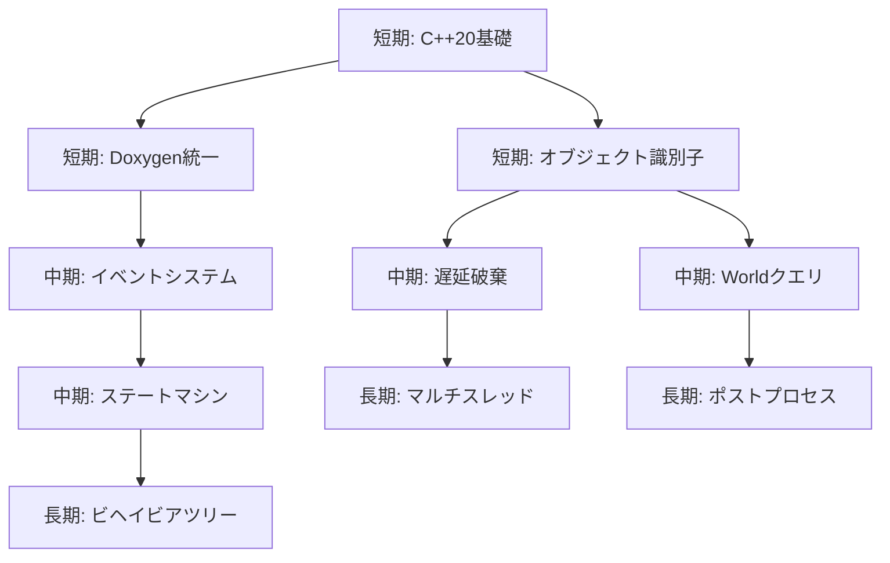

# DirectX11_Framework 改善提案書

このドキュメントは、DirectX11_Frameworkリポジトリの改善点を分析し、具体的な改善案とコードサンプルを提供します。

---

## 目次

1. [C++20の活用](#1-c20の活用)
2. [Sankou_00とSankou_01の活用と統合提案](#2-sankou_00とsankou_01の活用と統合提案)
3. [DirectX11のパフォーマンス最適化](#3-directx11のパフォーマンス最適化)
4. [GameObject+Componentモデルの改善提案](#4-entitycomponentモデルの改善提案)
5. [スタイルとドキュメント方針の整備](#5-スタイルとドキュメント方針の整備)
6. [モジュール設計とステートパターン](#6-モジュール設計とステートパターン)
7. [段階的な開発ロードマップ](#7-段階的な開発ロードマップ)

---

## 1. C++20の活用

### 1.1 Concepts（コンセプト）の導入

現状のテンプレート制約は`static_assert`で行われていますが、C++20のConceptsを使用することで、より明確で型安全なコードが実現できます。

#### 現状のコード（GameObject.h）
```cpp
template <class T, class... Args>
T* AddComponent(Args&&... args) {
    static_assert(std::is_base_of_v<Component, T>, "T must derive from Component");
    // ...
}
```

#### 改善案：Conceptsを使用
```cpp
// Source/Engine/Core/Concepts.h
#pragma once

#include <concepts>
#include <type_traits>

namespace Engine {

    // Componentの派生型であることを要求するConcept
    template <typename T>
    concept DerivedFromComponent = std::is_base_of_v<Component, T>;

    // 初期化可能な型であることを要求するConcept
    template <typename T>
    concept Initializable = requires(T t) {
        { t.Initialize() } -> std::same_as<bool>;
        { t.Finalize() } -> std::same_as<void>;
    };

    // 更新可能な型であることを要求するConcept
    template <typename T>
    concept Updatable = requires(T t, float dt) {
        { t.Update(dt) } -> std::same_as<void>;
    };

    // 描画可能な型であることを要求するConcept
    template <typename T>
    concept Drawable = requires(T t) {
        { t.Draw() } -> std::same_as<void>;
    };

} // namespace Engine
```

#### GameObject.hの改善
```cpp
#pragma once

#include <concepts>
#include "Engine/Core/Concepts.h"
#include "Engine/Scene/Component.h"

namespace Engine {

    class GameObject final {
    public:
        // Conceptsを使用した型制約
        template <DerivedFromComponent T, typename... Args>
        T* AddComponent(Args&&... args) {
            auto comp = std::make_unique<T>(std::forward<Args>(args)...);
            T* raw = comp.get();
            raw->SetOwner(this);
            m_components.emplace_back(std::move(comp));
            raw->OnAwake();
            if (m_hasStarted) {
                raw->OnStart();
            }
            return raw;
        }

        template <DerivedFromComponent T>
        T* GetComponent() {
            for (auto& c : m_components) {
                if (auto* t = dynamic_cast<T*>(c.get())) {
                    return t;
                }
            }
            return nullptr;
        }
        // ...
    };

} // namespace Engine
```

### 1.2 Ranges（範囲）ライブラリの導入

ループ処理をよりモダンで読みやすくするために、C++20のRangesライブラリを活用します。

#### 現状のコード（GameObject.cpp）
```cpp
void GameObject::UpdateComponents(float deltaTime) {
    if (!m_isEnabled) return;

    StartIfNeeded();

    for (auto& c : m_components) {
        if (c->IsEnabled()) {
            c->Update(deltaTime);
        }
    }
}
```

#### 改善案：Rangesを使用
```cpp
#include <ranges>
#include <algorithm>

void GameObject::UpdateComponents(float deltaTime) {
    if (!m_isEnabled) return;

    StartIfNeeded();

    // フィルタリングとアクションを宣言的に記述
    auto enabledComponents = m_components
        | std::views::filter([](const auto& c) { return c->IsEnabled(); });

    for (auto& c : enabledComponents) {
        c->Update(deltaTime);
    }
}
```

#### World.cppでの活用
```cpp
#include <ranges>
#include <algorithm>

void World::Update(float deltaTime) {
    if (!m_isInitialized) return;

    // range-based forとviewsを組み合わせて使用
    std::ranges::for_each(m_gameObjects, [deltaTime](auto& e) {
        e->UpdateComponents(deltaTime);
    });
}

GameObject* World::FindEntityByPredicate(auto predicate) {
    auto it = std::ranges::find_if(m_gameObjects, [&predicate](const auto& e) {
        return predicate(e.get());
    });
    return (it != m_gameObjects.end()) ? it->get() : nullptr;
}
```

### 1.3 std::span の活用

配列やベクターを渡す際に`std::span`を使用して、より安全で効率的なコードを実現します。

#### 改善案：GraphicsDevice.hでの活用
```cpp
#include <span>

class GraphicsDevice final {
public:
    // 現状: void Clear(const float clearColor[4]);
    // 改善: spanで安全性と明確さを向上
    void Clear(std::span<const float, 4> clearColor);

    // 複数のRenderTargetViewを設定する場合
    void SetRenderTargets(std::span<ID3D11RenderTargetView* const> rtvs,
                         ID3D11DepthStencilView* dsv);
};
```

### 1.4 std::format の活用

ログ出力をより安全で読みやすくするために、`std::format`を使用します。

#### Logger.hの改善
```cpp
#pragma once

#include <format>
#include <string_view>

namespace Engine {

    class Logger final {
    public:
        // 既存のメソッド
        static void Info(std::string_view message);

        // 新規：フォーマット対応メソッド
        template <typename... Args>
        static void InfoF(std::format_string<Args...> fmt, Args&&... args) {
            Info(std::format(fmt, std::forward<Args>(args)...));
        }

        template <typename... Args>
        static void ErrorF(std::format_string<Args...> fmt, Args&&... args) {
            Error(std::format(fmt, std::forward<Args>(args)...));
        }

        template <typename... Args>
        static void WarnF(std::format_string<Args...> fmt, Args&&... args) {
            Warn(std::format(fmt, std::forward<Args>(args)...));
        }
    };

} // namespace Engine

// 使用例
// Logger::InfoF("Entity count: {}", world.GetEntityCount());
// Logger::ErrorF("Failed to create buffer: width={}, height={}", width, height);
```

### 1.5 [[nodiscard]] と [[likely]]/[[unlikely]] 属性

戻り値の無視を防ぎ、分岐予測のヒントを提供します。

```cpp
class GraphicsDevice final {
public:
    // 初期化の戻り値は必ず確認すべき
    [[nodiscard]] bool Initialize(HWND hwnd, int width, int height, bool isVSyncEnabled);
    [[nodiscard]] bool Resize(int width, int height);

    void Clear(std::span<const float, 4> clearColor) {
        if (!m_isInitialized) [[unlikely]] return;

        if (m_rtv) [[likely]] {
            m_context->ClearRenderTargetView(m_rtv.Get(), clearColor.data());
        }
    }
};
```

### 1.6 constexpr と consteval の拡張利用

コンパイル時計算を活用してランタイムパフォーマンスを向上させます。

```cpp
// Source/Engine/Math/MathConstants.h
#pragma once

#include <numbers>

namespace Engine::Math {

    // C++20の数学定数
    inline constexpr float kPi = std::numbers::pi_v<float>;
    inline constexpr float kTwoPi = 2.0f * kPi;
    inline constexpr float kHalfPi = kPi / 2.0f;

    // コンパイル時計算可能な関数
    [[nodiscard]] constexpr float DegreesToRadians(float degrees) noexcept {
        return degrees * (kPi / 180.0f);
    }

    [[nodiscard]] constexpr float RadiansToDegrees(float radians) noexcept {
        return radians * (180.0f / kPi);
    }

    // コンパイル時のみ評価される関数
    [[nodiscard]] consteval float CompileTimeAngle(float degrees) noexcept {
        return DegreesToRadians(degrees);
    }

} // namespace Engine::Math
```

---

## 2. Sankou_00とSankou_01の活用と統合提案

### 2.1 Sankou_00からの統合可能パターン

#### 2.1.1 AudioSourceコンポーネント
Sankou_00にはAudioSourceの実装があり、これをDirectX11_Frameworkに統合できます。

```cpp
// Source/Engine/Audio/AudioSource.h
#pragma once

#include "Engine/Scene/Component.h"
#include <string>

namespace Engine {

    /// @brief オーディオ再生を担当するコンポーネント
    /// @note Sankou_00のAudioSource.cppを参考に実装
    class AudioSource final : public Component {
    public:
        AudioSource() = default;
        ~AudioSource() override = default;

        void OnAwake() override;
        void OnDestroy() override;

        /// @brief オーディオファイルをロード
        /// @param filePath ファイルパス
        /// @return ロード成功ならtrue
        [[nodiscard]] bool Load(const std::wstring& filePath);

        /// @brief 再生
        void Play();

        /// @brief 停止
        void Stop();

        /// @brief 一時停止
        void Pause();

        /// @brief ループ設定
        /// @param isLooping ループするか
        void SetLooping(bool isLooping);

        /// @brief ボリューム設定
        /// @param volume ボリューム (0.0 - 1.0)
        void SetVolume(float volume);

        [[nodiscard]] bool IsPlaying() const;
        [[nodiscard]] bool IsLooping() const;
        [[nodiscard]] float GetVolume() const;

    private:
        // XAudio2関連のメンバー（ComPtr使用）
        bool m_isPlaying = false;
        bool m_isLooping = false;
        float m_volume = 1.0f;
    };

} // namespace Engine
```

#### 2.1.2 ImGui統合パターン
Sankou_00ではImGuiを使用したデバッグUIがあります。

```cpp
// Source/Engine/Debug/ImGuiManager.h
#pragma once

namespace Engine {

    class GraphicsDevice;
    class Window;

    /// @brief ImGuiの初期化・更新・描画を管理
    /// @note Sankou_00のimgui.iniパターンを参考
    class ImGuiManager final {
    public:
        ImGuiManager() = default;
        ~ImGuiManager();

        ImGuiManager(const ImGuiManager&) = delete;
        ImGuiManager& operator=(const ImGuiManager&) = delete;

        [[nodiscard]] bool Initialize(Window* window, GraphicsDevice* device);
        void Finalize();

        void BeginFrame();
        void EndFrame();
        void Draw();

        [[nodiscard]] bool IsInitialized() const;

    private:
        bool m_isInitialized = false;
    };

} // namespace Engine
```

### 2.2 Sankou_01からの統合可能パターン

#### 2.2.1 ポストプロセスエフェクト
Sankou_01にはPostprocessフォルダがあり、これを参考にポストエフェクトを実装できます。

```cpp
// Source/Engine/Graphics/PostProcess/PostProcessEffect.h
#pragma once

#include <d3d11.h>
#include <wrl/client.h>
#include <memory>

namespace Engine {

    class GraphicsDevice;
    class PixelShader;

    /// @brief ポストプロセスエフェクトの基底クラス
    /// @note Sankou_01のPostprocessディレクトリを参考
    class PostProcessEffect {
    public:
        PostProcessEffect() = default;
        virtual ~PostProcessEffect() = default;

        PostProcessEffect(const PostProcessEffect&) = delete;
        PostProcessEffect& operator=(const PostProcessEffect&) = delete;

        [[nodiscard]] virtual bool Initialize(GraphicsDevice* device) = 0;
        virtual void Finalize() = 0;

        /// @brief エフェクトを適用
        /// @param context デバイスコンテキスト
        /// @param source  入力テクスチャ
        /// @param target  出力テクスチャ
        virtual void Apply(ID3D11DeviceContext* context,
                          ID3D11ShaderResourceView* source,
                          ID3D11RenderTargetView* target) = 0;

        void Enable();
        void Disable();
        [[nodiscard]] bool IsEnabled() const;

    protected:
        bool m_isEnabled = true;
    };

    /// @brief ブルームエフェクト
    class BloomEffect final : public PostProcessEffect {
    public:
        [[nodiscard]] bool Initialize(GraphicsDevice* device) override;
        void Finalize() override;

        void Apply(ID3D11DeviceContext* context,
                  ID3D11ShaderResourceView* source,
                  ID3D11RenderTargetView* target) override;

        void SetThreshold(float threshold);
        void SetIntensity(float intensity);

    private:
        std::shared_ptr<PixelShader> m_extractPS;
        std::shared_ptr<PixelShader> m_blurPS;
        std::shared_ptr<PixelShader> m_combinePS;

        float m_threshold = 1.0f;
        float m_intensity = 1.0f;
    };

} // namespace Engine
```

#### 2.2.2 HDRレンダリング
Sankou_01にはHDRフォルダがあり、これを参考にHDRパイプラインを実装できます。

```cpp
// Source/Engine/Graphics/HDR/HDRPipeline.h
#pragma once

#include <d3d11.h>
#include <wrl/client.h>

namespace Engine {

    class GraphicsDevice;

    /// @brief HDRレンダリングパイプライン
    /// @note Sankou_01のHDRディレクトリを参考
    class HDRPipeline final {
    public:
        HDRPipeline() = default;
        ~HDRPipeline();

        [[nodiscard]] bool Initialize(GraphicsDevice* device, int width, int height);
        void Finalize();

        /// @brief HDRレンダーターゲットにバインド
        void BeginHDRPass(ID3D11DeviceContext* context);

        /// @brief トーンマッピングを適用してLDRに変換
        void EndHDRPass(ID3D11DeviceContext* context, ID3D11RenderTargetView* finalTarget);

        void SetExposure(float exposure);
        [[nodiscard]] float GetExposure() const;

    private:
        Microsoft::WRL::ComPtr<ID3D11Texture2D> m_hdrBuffer;
        Microsoft::WRL::ComPtr<ID3D11RenderTargetView> m_hdrRTV;
        Microsoft::WRL::ComPtr<ID3D11ShaderResourceView> m_hdrSRV;

        float m_exposure = 1.0f;
        bool m_isInitialized = false;
    };

} // namespace Engine
```

---

## 3. DirectX11のパフォーマンス最適化

### 3.1 マルチスレッドコマンドリスト

```cpp
// Source/Engine/Graphics/DeferredContext.h
#pragma once

#include <d3d11.h>
#include <wrl/client.h>

namespace Engine {

    class GraphicsDevice;

    /// @brief 遅延コンテキストを使用したマルチスレッドレンダリング
    class DeferredContext final {
    public:
        DeferredContext() = default;
        ~DeferredContext();

        [[nodiscard]] bool Initialize(GraphicsDevice* device);
        void Finalize();

        /// @brief コマンドの記録を開始
        void BeginRecording();

        /// @brief コマンドリストを生成
        /// @return コマンドリスト
        [[nodiscard]] Microsoft::WRL::ComPtr<ID3D11CommandList> FinishRecording();

        /// @brief 遅延コンテキストを取得
        [[nodiscard]] ID3D11DeviceContext* GetContext() const;

    private:
        Microsoft::WRL::ComPtr<ID3D11DeviceContext> m_deferredContext;
    };

} // namespace Engine
```

### 3.2 バッチレンダリングとインスタンシング

```cpp
// Source/Engine/Graphics/InstancedRenderer.h
#pragma once

#include <d3d11.h>
#include <wrl/client.h>
#include <DirectXMath.h>
#include <vector>

namespace Engine {

    /// @brief インスタンスデータ
    struct InstanceData {
        DirectX::XMFLOAT4X4 m_world;
        DirectX::XMFLOAT4   m_color;
    };

    /// @brief インスタンシング描画を管理
    class InstancedRenderer final {
    public:
        InstancedRenderer() = default;
        ~InstancedRenderer();

        [[nodiscard]] bool Initialize(ID3D11Device* device, std::uint32_t maxInstances);
        void Finalize();

        /// @brief インスタンスを追加
        void AddInstance(const InstanceData& instance);

        /// @brief バッチをクリア
        void ClearInstances();

        /// @brief 全インスタンスを一括描画
        void DrawInstanced(ID3D11DeviceContext* context, Mesh* mesh, Material* material);

        [[nodiscard]] std::uint32_t GetInstanceCount() const;

    private:
        std::vector<InstanceData> m_instances;
        Microsoft::WRL::ComPtr<ID3D11Buffer> m_instanceBuffer;
        std::uint32_t m_maxInstances = 0;
    };

} // namespace Engine
```

### 3.3 ステート管理の最適化

```cpp
// Source/Engine/Graphics/StateCache.h
#pragma once

#include <d3d11.h>
#include <wrl/client.h>
#include <unordered_map>

namespace Engine {

    /// @brief 描画ステートのキャッシュと再利用
    /// @note ステート変更を最小限に抑えてパフォーマンス向上
    class StateCache final {
    public:
        StateCache() = default;
        ~StateCache();

        [[nodiscard]] bool Initialize(ID3D11Device* device);
        void Finalize();

        /// @brief ラスタライザステートを取得（キャッシュまたは作成）
        [[nodiscard]] ID3D11RasterizerState* GetRasterizerState(
            D3D11_CULL_MODE cullMode,
            D3D11_FILL_MODE fillMode);

        /// @brief ブレンドステートを取得（キャッシュまたは作成）
        [[nodiscard]] ID3D11BlendState* GetBlendState(bool isAlphaBlend);

        /// @brief 深度ステンシルステートを取得（キャッシュまたは作成）
        [[nodiscard]] ID3D11DepthStencilState* GetDepthStencilState(
            bool depthTest,
            bool depthWrite);

        /// @brief キャッシュをクリア
        void ClearCache();

    private:
        ID3D11Device* m_device = nullptr;

        // ハッシュベースのキャッシュ
        std::unordered_map<std::uint32_t,
            Microsoft::WRL::ComPtr<ID3D11RasterizerState>> m_rsCache;
        std::unordered_map<std::uint32_t,
            Microsoft::WRL::ComPtr<ID3D11BlendState>> m_bsCache;
        std::unordered_map<std::uint32_t,
            Microsoft::WRL::ComPtr<ID3D11DepthStencilState>> m_dssCache;
    };

} // namespace Engine
```

### 3.4 テクスチャストリーミング

```cpp
// Source/Engine/Resources/TextureStreamer.h
#pragma once

#include <d3d11.h>
#include <string>
#include <queue>
#include <mutex>
#include <future>

namespace Engine {

    class Texture;

    /// @brief 非同期テクスチャローディング
    class TextureStreamer final {
    public:
        TextureStreamer() = default;
        ~TextureStreamer();

        [[nodiscard]] bool Initialize(ID3D11Device* device);
        void Finalize();

        /// @brief テクスチャの非同期ロードをリクエスト
        /// @param path ファイルパス
        /// @return ロード完了時に結果を返すfuture
        [[nodiscard]] std::future<std::shared_ptr<Texture>>
            LoadAsync(const std::wstring& path);

        /// @brief 保留中のロードを処理
        void ProcessPendingLoads();

    private:
        ID3D11Device* m_device = nullptr;
        std::queue<std::wstring> m_loadQueue;
        std::mutex m_mutex;
    };

} // namespace Engine
```

---

## 4. GameObject+Componentモデルの改善提案

### 4.1 コンポーネントキャッシュの導入

頻繁にアクセスされるコンポーネントのルックアップを高速化します。

```cpp
// Source/Engine/Scene/GameObject.h (改善版)
#pragma once

#include <memory>
#include <type_traits>
#include <vector>
#include <unordered_map>
#include <typeindex>

namespace Engine {

    class GameObject final {
    public:
        // ... 既存のメソッド ...

        /// @brief コンポーネントを取得（キャッシュ付き）
        /// @tparam T コンポーネント型
        /// @return コンポーネントへのポインタ（存在しない場合nullptr）
        template <DerivedFromComponent T>
        T* GetComponent() {
            // キャッシュをチェック
            const std::type_index typeIndex(typeid(T));
            if (auto it = m_componentCache.find(typeIndex); it != m_componentCache.end()) {
                return static_cast<T*>(it->second);
            }

            // キャッシュミス：線形検索してキャッシュに追加
            for (auto& c : m_components) {
                if (auto* t = dynamic_cast<T*>(c.get())) {
                    m_componentCache[typeIndex] = t;
                    return t;
                }
            }
            return nullptr;
        }

        /// @brief 複数のコンポーネントを取得
        /// @tparam T コンポーネント型
        /// @return コンポーネントのベクター
        template <DerivedFromComponent T>
        std::vector<T*> GetComponents() {
            std::vector<T*> result;
            for (auto& c : m_components) {
                if (auto* t = dynamic_cast<T*>(c.get())) {
                    result.push_back(t);
                }
            }
            return result;
        }

        /// @brief コンポーネントキャッシュを無効化
        void InvalidateComponentCache() {
            m_componentCache.clear();
        }

    private:
        std::unordered_map<std::type_index, Component*> m_componentCache;
    };

} // namespace Engine
```

### 4.2 イベントシステムの導入

コンポーネント間の疎結合な通信を実現します。

```cpp
// Source/Engine/Core/EventSystem.h
#pragma once

#include <functional>
#include <unordered_map>
#include <vector>
#include <string>
#include <any>

namespace Engine {

    /// @brief 型安全なイベントシステム
    class EventSystem final {
    public:
        using EventId = std::string;
        using Callback = std::function<void(const std::any&)>;
        using Handle = std::uint64_t;

        static EventSystem& GetInstance() {
            static EventSystem instance;
            return instance;
        }

        /// @brief イベントを購読
        /// @tparam T イベントデータ型
        /// @param eventId イベント識別子
        /// @param callback コールバック関数
        /// @return 購読ハンドル（解除に使用）
        template <typename T>
        [[nodiscard]] Handle Subscribe(const EventId& eventId,
                                       std::function<void(const T&)> callback) {
            Handle handle = m_nextHandle++;
            m_callbacks[eventId].push_back({
                handle,
                [callback](const std::any& data) {
                    callback(std::any_cast<const T&>(data));
                }
            });
            return handle;
        }

        /// @brief 購読を解除
        /// @param eventId イベント識別子
        /// @param handle 購読ハンドル
        void Unsubscribe(const EventId& eventId, Handle handle);

        /// @brief イベントを発行
        /// @tparam T イベントデータ型
        /// @param eventId イベント識別子
        /// @param data イベントデータ
        template <typename T>
        void Publish(const EventId& eventId, const T& data) {
            if (auto it = m_callbacks.find(eventId); it != m_callbacks.end()) {
                for (auto& [handle, callback] : it->second) {
                    callback(std::any(data));
                }
            }
        }

    private:
        EventSystem() = default;

        struct CallbackEntry {
            Handle m_handle;
            Callback m_callback;
        };

        std::unordered_map<EventId, std::vector<CallbackEntry>> m_callbacks;
        Handle m_nextHandle = 1;
    };

} // namespace Engine

// 使用例
// EventSystem::GetInstance().Subscribe<DamageEvent>("OnDamage", [](const DamageEvent& e) {
//     Logger::InfoF("Damage: {}", e.amount);
// });
//
// EventSystem::GetInstance().Publish("OnDamage", DamageEvent{ 10.0f });
```

### 4.3 オブジェクト識別子とタグシステム

```cpp
// Source/Engine/Scene/EntityId.h
#pragma once

#include <cstdint>
#include <string>
#include <set>

namespace Engine {

    /// @brief GameObjectの一意識別子
    struct EntityId {
        std::uint64_t m_value = 0;

        constexpr bool operator==(const EntityId& other) const = default;
        constexpr auto operator<=>(const EntityId& other) const = default;

        [[nodiscard]] constexpr bool IsValid() const { return m_value != 0; }

        static EntityId Generate() {
            static std::uint64_t s_nextId = 1;
            return EntityId{ s_nextId++ };
        }
    };

} // namespace Engine

// GameObject.h への追加
class GameObject final {
public:
    // ... 既存のメソッド ...

    /// @brief GameObjectIDを取得
    [[nodiscard]] EntityId GetId() const { return m_id; }

    /// @brief 名前を設定
    void SetName(const std::string& name) { m_name = name; }

    /// @brief 名前を取得
    [[nodiscard]] const std::string& GetName() const { return m_name; }

    /// @brief タグを追加
    void AddTag(const std::string& tag) { m_tags.insert(tag); }

    /// @brief タグを削除
    void RemoveTag(const std::string& tag) { m_tags.erase(tag); }

    /// @brief タグを持っているか確認
    [[nodiscard]] bool HasTag(const std::string& tag) const {
        return m_tags.contains(tag);
    }

private:
    EntityId m_id = EntityId::Generate();
    std::string m_name;
    std::set<std::string> m_tags;
};
```

### 4.4 Worldクエリシステム

```cpp
// World.h への追加

class World final {
public:
    // ... 既存のメソッド ...

    /// @brief 名前でGameObjectを検索
    /// @param name 検索する名前
    /// @return 見つかったGameObject（存在しない場合nullptr）
    [[nodiscard]] GameObject* FindObjectByName(const std::string& name);

    /// @brief タグを持つGameObjectを検索
    /// @param tag 検索するタグ
    /// @return 見つかったGameObjectのベクター
    [[nodiscard]] std::vector<GameObject*> FindObjectsWithTag(const std::string& tag);

    /// @brief 特定のコンポーネントを持つGameObjectを検索
    /// @tparam T コンポーネント型
    /// @return 見つかったGameObjectのベクター
    template <DerivedFromComponent T>
    [[nodiscard]] std::vector<GameObject*> FindObjectsWithComponent() {
        std::vector<GameObject*> result;
        for (auto& e : m_gameObjects) {
            if (e->GetComponent<T>() != nullptr) {
                result.push_back(e.get());
            }
        }
        return result;
    }

    /// @brief 条件を満たすGameObjectを検索
    /// @param predicate 検索条件
    /// @return 見つかったGameObjectのベクター
    template <typename Predicate>
    [[nodiscard]] std::vector<GameObject*> FindObjectsWhere(Predicate predicate) {
        std::vector<GameObject*> result;
        for (auto& e : m_gameObjects) {
            if (predicate(e.get())) {
                result.push_back(e.get());
            }
        }
        return result;
    }
};
```

### 4.5 遅延破棄システム

```cpp
// World.h/cpp の改善

class World final {
public:
    // ... 既存のメソッド ...

    /// @brief GameObjectを次のフレームで破棄予約
    /// @param entity 破棄するGameObject
    void DestroyObjectDeferred(GameObject* entity);

private:
    /// @brief フレーム終了時に破棄予約されたGameObjectを削除
    void ProcessPendingDestructions();

private:
    std::vector<GameObject*> m_pendingDestruction;
};

// World.cpp
void World::DestroyObjectDeferred(GameObject* entity) {
    if (entity == nullptr) return;
    m_pendingDestruction.push_back(entity);
}

void World::ProcessPendingDestructions() {
    for (GameObject* entity : m_pendingDestruction) {
        DestroyObject(entity);
    }
    m_pendingDestruction.clear();
}

// Update の最後で呼び出す
void World::Update(float deltaTime) {
    if (!m_isInitialized) return;

    for (auto& e : m_gameObjects) {
        e->UpdateComponents(deltaTime);
    }

    // フレーム終了時に遅延破棄を処理
    ProcessPendingDestructions();
}
```

---

## 5. スタイルとドキュメント方針の整備

### 5.1 Doxygen形式コメントのテンプレート

現在のREADMEに記載されている形式を統一して使用します。

```cpp
/// @brief  関数の簡易的な説明
/// @param  paramName パラメータの説明
/// @return 返り値の説明（返り値がある場合）
/// @note   詳細な説明（必要に応じて複数行）
/// @see    関連する関数やクラス
/// @warning 注意事項（必要な場合）
```

### 5.2 ヘッダファイルテンプレート

```cpp
/// @file   ファイル名.h
/// @brief  このファイルの概要説明
/// @author 著者名（任意）
/// @date   作成日（任意）
#pragma once

#include <必要なヘッダー>

namespace Engine {

    /// @brief クラスの簡易的な説明
    /// @note  詳細な説明や使用例
    class ClassName final {
    public:
        //============================================================
        // コンストラクタ/デストラクタ
        //============================================================
        ClassName() = default;
        ~ClassName();

        // コピー/ムーブの禁止（必要に応じて）
        ClassName(const ClassName&) = delete;
        ClassName& operator=(const ClassName&) = delete;

        //============================================================
        // ライフサイクル
        //============================================================
        /// @brief  初期化
        /// @param  settings 設定パラメータ
        /// @return 成功ならtrue
        [[nodiscard]] bool Initialize(const Settings& settings);

        /// @brief 終了処理
        void Finalize();

        //============================================================
        // 機能グループ名
        //============================================================
        /// @brief  機能の説明
        /// @param  paramName パラメータの説明
        void SomeFunction(int paramName);

    private:
        //============================================================
        // 内部メソッド
        //============================================================
        void InternalHelper();

    private:
        //============================================================
        // メンバ変数
        //============================================================
        bool m_isInitialized = false;    ///< 初期化済みフラグ
        int  m_someValue     = 0;        ///< 値の説明
    };

} // namespace Engine
```

### 5.3 命名規則チェックリスト

| カテゴリ | 規則 | 例 |
|---------|------|-----|
| クラス/構造体 | UpperCamelCase | `GraphicsDevice`, `RenderSystem` |
| enum | UpperCamelCase | `ComponentType`, `RenderLayer` |
| 関数 | UpperCamelCase | `Initialize()`, `GetComponent()` |
| ローカル変数 | lowerCamelCase | `deltaTime`, `entityCount` |
| メンバ変数 | m_lowerCamelCase | `m_device`, `m_isEnabled` |
| static変数 | s_lowerCamelCase | `s_instanceCount` |
| 定数 | kUpperCamelCase | `kMaxSpeed`, `kDefaultFov` |
| bool型 | Is接頭辞 | `IsEnabled()`, `m_isActive` |
| ファイル名 | UpperCamelCase | `GraphicsDevice.cpp` |

### 5.4 現在のコードでの修正点

以下のファイルでコメント形式の統一が必要です：

1. **Transform.h** - 一部のコメントで列の揃え方が不統一
2. **GameObject.h** - テンプレートメソッドにDoxygenコメントがない
3. **RenderSystem.h** - RenderItem構造体のメンバーにコメントがない

---

## 6. モジュール設計とステートパターン

### 6.1 ステートマシンの導入

```cpp
// Source/Engine/AI/StateMachine.h
#pragma once

#include <memory>
#include <string>
#include <unordered_map>
#include <functional>

namespace Engine {

    template <typename Context>
    class IState;

    /// @brief 汎用ステートマシン
    /// @tparam Context ステートで使用するコンテキスト型
    template <typename Context>
    class StateMachine final {
    public:
        using StatePtr = std::unique_ptr<IState<Context>>;
        using StateId = std::string;

        StateMachine() = default;
        ~StateMachine() = default;

        StateMachine(const StateMachine&) = delete;
        StateMachine& operator=(const StateMachine&) = delete;

        /// @brief ステートを登録
        /// @param id      ステート識別子
        /// @param state   ステートオブジェクト
        void RegisterState(const StateId& id, StatePtr state) {
            m_states[id] = std::move(state);
        }

        /// @brief 初期ステートを設定
        /// @param id      初期ステートの識別子
        /// @param context コンテキスト
        void Start(const StateId& id, Context& context) {
            if (auto it = m_states.find(id); it != m_states.end()) {
                m_currentStateId = id;
                m_currentState = it->second.get();
                m_currentState->OnEnter(context);
            }
        }

        /// @brief 毎フレーム更新
        /// @param context   コンテキスト
        /// @param deltaTime フレーム経過時間
        void Update(Context& context, float deltaTime) {
            if (m_currentState) {
                m_currentState->Update(context, deltaTime);
            }
        }

        /// @brief ステートを遷移
        /// @param id      遷移先ステートの識別子
        /// @param context コンテキスト
        void ChangeState(const StateId& id, Context& context) {
            if (auto it = m_states.find(id); it != m_states.end()) {
                if (m_currentState) {
                    m_currentState->OnExit(context);
                }
                m_currentStateId = id;
                m_currentState = it->second.get();
                m_currentState->OnEnter(context);
            }
        }

        /// @brief 現在のステートIDを取得
        [[nodiscard]] const StateId& GetCurrentStateId() const {
            return m_currentStateId;
        }

    private:
        std::unordered_map<StateId, StatePtr> m_states;
        IState<Context>* m_currentState = nullptr;
        StateId m_currentStateId;
    };

    /// @brief ステートインターフェース
    template <typename Context>
    class IState {
    public:
        virtual ~IState() = default;

        /// @brief ステート開始時に呼ばれる
        virtual void OnEnter(Context& context) = 0;

        /// @brief ステート終了時に呼ばれる
        virtual void OnExit(Context& context) = 0;

        /// @brief 毎フレーム更新
        virtual void Update(Context& context, float deltaTime) = 0;
    };

} // namespace Engine
```

### 6.2 ビヘイビアツリーの導入

```cpp
// Source/Engine/AI/BehaviorTree.h
#pragma once

#include <memory>
#include <vector>
#include <string>

namespace Engine {

    /// @brief ビヘイビアツリーのノード実行結果
    enum class BehaviorStatus {
        Success,   ///< 成功
        Failure,   ///< 失敗
        Running    ///< 実行中
    };

    template <typename Context>
    class BehaviorNode;

    /// @brief ビヘイビアツリー
    template <typename Context>
    class BehaviorTree final {
    public:
        using NodePtr = std::unique_ptr<BehaviorNode<Context>>;

        BehaviorTree() = default;
        ~BehaviorTree() = default;

        /// @brief ルートノードを設定
        void SetRoot(NodePtr root) {
            m_root = std::move(root);
        }

        /// @brief ツリーを評価
        BehaviorStatus Tick(Context& context) {
            if (m_root) {
                return m_root->Execute(context);
            }
            return BehaviorStatus::Failure;
        }

    private:
        NodePtr m_root;
    };

    /// @brief ビヘイビアノード基底クラス
    template <typename Context>
    class BehaviorNode {
    public:
        virtual ~BehaviorNode() = default;

        /// @brief ノードを実行
        virtual BehaviorStatus Execute(Context& context) = 0;
    };

    /// @brief シーケンスノード（すべての子が成功で成功）
    template <typename Context>
    class SequenceNode final : public BehaviorNode<Context> {
    public:
        void AddChild(std::unique_ptr<BehaviorNode<Context>> child) {
            m_children.push_back(std::move(child));
        }

        BehaviorStatus Execute(Context& context) override {
            for (auto& child : m_children) {
                BehaviorStatus status = child->Execute(context);
                if (status != BehaviorStatus::Success) {
                    return status;
                }
            }
            return BehaviorStatus::Success;
        }

    private:
        std::vector<std::unique_ptr<BehaviorNode<Context>>> m_children;
    };

    /// @brief セレクターノード（いずれかの子が成功で成功）
    template <typename Context>
    class SelectorNode final : public BehaviorNode<Context> {
    public:
        void AddChild(std::unique_ptr<BehaviorNode<Context>> child) {
            m_children.push_back(std::move(child));
        }

        BehaviorStatus Execute(Context& context) override {
            for (auto& child : m_children) {
                BehaviorStatus status = child->Execute(context);
                if (status != BehaviorStatus::Failure) {
                    return status;
                }
            }
            return BehaviorStatus::Failure;
        }

    private:
        std::vector<std::unique_ptr<BehaviorNode<Context>>> m_children;
    };

    /// @brief アクションノード（実際の処理を行う）
    template <typename Context>
    class ActionNode final : public BehaviorNode<Context> {
    public:
        using ActionFunc = std::function<BehaviorStatus(Context&)>;

        explicit ActionNode(ActionFunc action) : m_action(std::move(action)) {}

        BehaviorStatus Execute(Context& context) override {
            return m_action(context);
        }

    private:
        ActionFunc m_action;
    };

} // namespace Engine
```

### 6.3 コマンドパターン

```cpp
// Source/Engine/Core/Command.h
#pragma once

#include <memory>
#include <stack>
#include <vector>

namespace Engine {

    /// @brief コマンドインターフェース
    class ICommand {
    public:
        virtual ~ICommand() = default;

        /// @brief コマンドを実行
        virtual void Execute() = 0;

        /// @brief コマンドを取り消し
        virtual void Undo() = 0;
    };

    /// @brief コマンド履歴を管理
    class CommandHistory final {
    public:
        CommandHistory() = default;
        ~CommandHistory() = default;

        /// @brief コマンドを実行して履歴に追加
        void Execute(std::unique_ptr<ICommand> command) {
            command->Execute();
            m_undoStack.push(std::move(command));

            // Redoスタックをクリア
            while (!m_redoStack.empty()) {
                m_redoStack.pop();
            }
        }

        /// @brief 直前のコマンドを取り消し
        void Undo() {
            if (m_undoStack.empty()) return;

            auto command = std::move(m_undoStack.top());
            m_undoStack.pop();
            command->Undo();
            m_redoStack.push(std::move(command));
        }

        /// @brief 取り消したコマンドをやり直し
        void Redo() {
            if (m_redoStack.empty()) return;

            auto command = std::move(m_redoStack.top());
            m_redoStack.pop();
            command->Execute();
            m_undoStack.push(std::move(command));
        }

        /// @brief Undo可能か
        [[nodiscard]] bool CanUndo() const { return !m_undoStack.empty(); }

        /// @brief Redo可能か
        [[nodiscard]] bool CanRedo() const { return !m_redoStack.empty(); }

        /// @brief 履歴をクリア
        void Clear() {
            while (!m_undoStack.empty()) m_undoStack.pop();
            while (!m_redoStack.empty()) m_redoStack.pop();
        }

    private:
        std::stack<std::unique_ptr<ICommand>> m_undoStack;
        std::stack<std::unique_ptr<ICommand>> m_redoStack;
    };

} // namespace Engine
```

---

## 7. 段階的な開発ロードマップ

### 7.1 短期目標（1-2ヶ月）

| 優先度 | 項目 | 説明 | 工数 |
|--------|------|------|------|
| 高 | C++20 Concepts導入 | Entity/Componentでのテンプレート制約強化 | 2-3日 |
| 高 | [[nodiscard]]属性追加 | Initialize/Load系関数への追加 | 1日 |
| 高 | Doxygenコメント統一 | 全ファイルのコメント形式統一 | 3-5日 |
| 中 | std::format導入 | Logger/Assert向上 | 2日 |
| 中 | オブジェクト識別子導入 | EntityId/Name/Tagシステム | 3日 |
| 低 | constexpr数学関数 | MathConstants.h追加 | 1日 |

### 7.2 中期目標（3-6ヶ月）

| 優先度 | 項目 | 説明 | 工数 |
|--------|------|------|------|
| 高 | イベントシステム | コンポーネント間通信 | 1週間 |
| 高 | 遅延破棄システム | 安全なEntity破棄 | 2-3日 |
| 高 | ステートマシン | AIとゲームロジック用 | 1週間 |
| 中 | ステートキャッシュ | 描画パフォーマンス向上 | 1週間 |
| 中 | コンポーネントキャッシュ | GetComponent高速化 | 2日 |
| 中 | Worldクエリシステム | 名前/タグ検索機能 | 3日 |
| 低 | std::ranges導入 | ループ処理のモダナイズ | 2-3日 |

### 7.3 長期目標（6ヶ月-1年）

| 優先度 | 項目 | 説明 | 工数 |
|--------|------|------|------|
| 高 | ポストプロセス | Bloom/HDR等 (Sankou_01参考) | 2-3週間 |
| 高 | インスタンシング | バッチ描画最適化 | 2週間 |
| 中 | マルチスレッド描画 | DeferredContext活用 | 2週間 |
| 中 | AudioSystem | Sankou_00参考 | 2週間 |
| 中 | ビヘイビアツリー | AI実装用 | 2週間 |
| 中 | ImGui統合 | デバッグUI | 1週間 |
| 低 | テクスチャストリーミング | 非同期ロード | 2週間 |
| 低 | コマンドパターン | Undo/Redo機能 | 1週間 |

### 7.4 実装の優先順位



---

## 8. 付録：サンプル実装

### 8.1 C++20 Concepts導入のPR案

以下のファイルを修正：

1. **Source/Engine/Core/Concepts.h** （新規作成）
2. **Source/Engine/Scene/GameObject.h** （Concepts使用に変更）
3. **Source/Engine/Scene/World.h** （クエリメソッド追加）

### 8.2 イベントシステム導入のPR案

以下のファイルを修正：

1. **Source/Engine/Core/EventSystem.h** （新規作成）
2. **Source/Engine/Core/EventSystem.cpp** （新規作成）
3. **Source/Engine/Scene/Component.h** （イベント購読用ヘルパー追加）

### 8.3 ステートマシン導入のPR案

以下のファイルを作成：

1. **Source/Engine/AI/StateMachine.h** （新規作成）
2. **Source/Game/Scripts/PlayerStateMachine.h** （使用例）

---

## まとめ

このドキュメントでは、DirectX11_Frameworkの改善案を以下の観点から提案しました：

1. **C++20の活用** - Concepts、Ranges、std::format等のモダン機能
2. **参考リポジトリの統合** - Sankou_00/01からの機能取り込み
3. **パフォーマンス最適化** - インスタンシング、ステートキャッシュ等
4. **アーキテクチャ改善** - イベントシステム、クエリシステム等
5. **コーディング規約** - Doxygen形式の統一
6. **設計パターン** - ステートマシン、ビヘイビアツリー等
7. **ロードマップ** - 短期・中期・長期の段階的計画

各提案は、現在のコードベースとの互換性を維持しながら、段階的に導入できるように設計されています。
